# example-SparkFun-MicroMod-nRF52840

This example has been designed for this workshop hosted by SparkFun: [AI Workshop: Meet Your New Fitness Trainer](https://learn.sparkfun.com/events/204_).

This tutorial is using:

**Tools and Softwares:**

- [Edge Impulse Studio](https://studio.edgeimpulse.com) and [Edge Impulse CLI](https://docs.edgeimpulse.com/docs/cli-installation)
- [Arduino IDE](https://www.arduino.cc/en/software)
- Nordic Semiconductors nRF Connect App: [Google Play](https://play.google.com/store/apps/details?id=no.nordicsemi.android.mcp) or [App Store](https://itunes.apple.com/us/app/nrf-connect/id1054362403?ls=1&mt=8)

**Hardware:**

- [SparkFun MicroMod Machine Learning Carrier Board](https://www.sparkfun.com/products/16400)
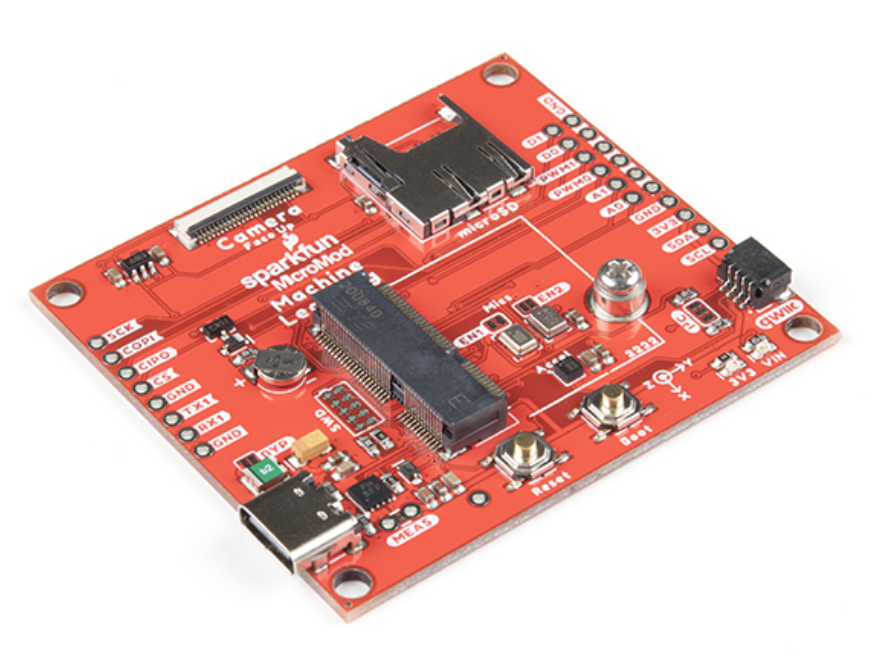
- [Nordic NRF52840 MicroMod Processor Board](https://www.sparkfun.com/products/16984)
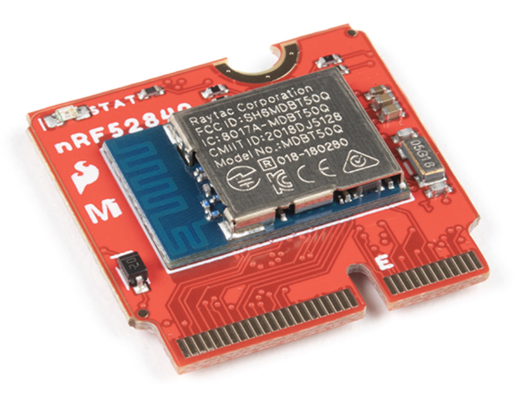

*For more details about the nRF52840 multiprotocol connectivity SoC, please see:* [https://www.nordicsemi.com/*Products/Low-power-short-range-wireless/nRF52840](https://www.nordicsemi.com/Products/Low-power-short-range-wireless/nRF52840)

### Overview 

- [Installing the dependencies](#installing-the-dependencies)
- [Collecting data](#collecting-data)
- [Train your Machine Learning Model](#train-your-machine-learning-model)
- [Run your inference on the target](#run-your-inference-on-the-target)
- [Going further: Send your inference over Bluetooth](#going-further-send-your-inference-over-bluetooth)
- [Resources](#resources)

## Installing the dependencies

### Install Arduino IDE

Download the lastest Arduino version: [https://www.arduino.cc/en/main/software](https://www.arduino.cc/en/main/software)

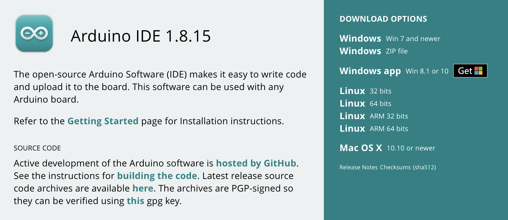

We have been testing this project with Arduino 1.8.13 and 1.8.15 on macOS Big Sur and 1.8.15 on Windows 10. We do not recommend to use the Arduino IDE 2.0 beta at the moment as it has some breaking changes.

### Adding the MicroMod nRF52840 Board to Arduino IDE

A complete and official guide is provided in the following link to setup Arduino IDE to run with the nRF52840 Processor board: [https://learn.sparkfun.com/tutorials/micromod-nrf52840-processor-hookup-guide/arduino-software-setup](https://learn.sparkfun.com/tutorials/micromod-nrf52840-processor-hookup-guide/arduino-software-setup).

*Note that recently, Arduino has deprecated the Arduino Mbed OS Boards to provided standalone package for each boards:*

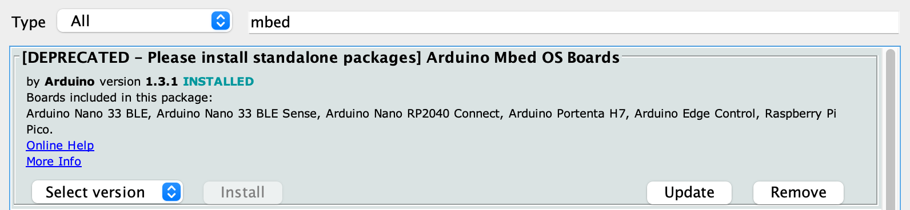

In order to be able to compile and run this project on the MicroMod nRF52840 Processor, you will need to install the **specific version `1.3.1`** of the Arduino Mbed OS Board, which is now deprecated. Sparkfun is working on a fix, the official guide should be update once done.

If you are not sure how to add the board manually, you can copy-paste the `mbed` folder present in this repository under `arduino-board-mbed-os-v1.3.1/` and add it to your Arduino application folder under:

- Windows: `%LOCALAPPDATA%\Arduino15\packages\arduino\hardware\mbed\`
- OSX: `~/Library/Arduino15/packages/arduino/hardware/mbed/`
- Linux: `~/.arduino15/packages/arduino/hardware/mbed/`

To open the Arduino application folder directly from the Arduino IDE, open the `Preferences` and click on the link looking like `User/.../Library/Arduino15/preferences.txt`:

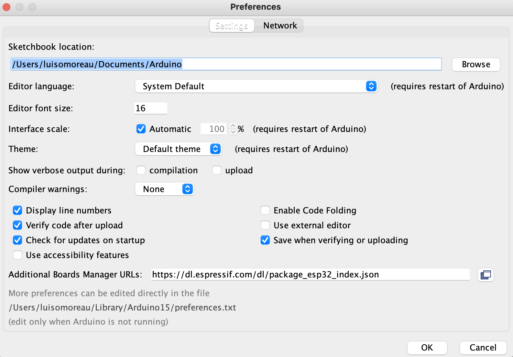

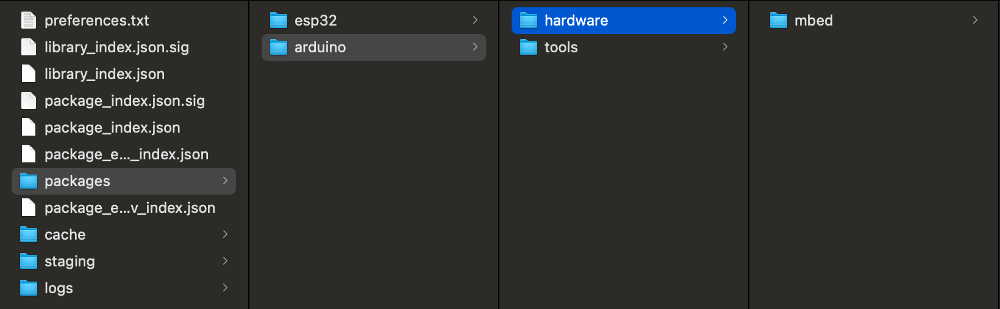

*If the `package` folder is not yet present in your Arduino application folder, install the `[DEPRECATED] Arduino Mbed OS Boards` board from `Tools -> Board -> Board Manager` as shown just before and replace the `mbed` folder with the one present in this github repository.*


Do not forget to restart your Arduino IDE after having added the board in the application folder.

### Run the data-forwarder-example sketch

To make sure the board works, test the `data-forwarder-example` sketch present in this repository under `arduino-examples/data-forwarder-example/`. Just open the `.ino` file or copy past the following code in a new sketch:

```
#include <Wire.h>

#include "SparkFun_LIS2DH12.h" //Click here to get the library: http://librarymanager/All#SparkFun_LIS2DH12
SPARKFUN_LIS2DH12 accel;       //Create instance

#define FREQUENCY_HZ        50
#define INTERVAL_MS         (1000 / (FREQUENCY_HZ + 1))

static unsigned long last_interval = 0;

void setup() {
    Serial.begin(115200);
    delay(2000);
    Serial.println("Accelerometer reading in Serial Console to be forwarded to Edge Impulse");

    Serial.print("FREQUENCY_HZ: ");
    Serial.println(FREQUENCY_HZ);

    Serial.print("INTERVAL_MS: ");
    Serial.println(INTERVAL_MS);

    Wire.begin();

    if (accel.begin() == false)
    {
      Serial.println("Accelerometer not detected. Check address jumper and wiring. Freezing...");
      while (1);
    }else{
      accel.setScale(LIS2DH12_2g);
      Serial.print("Accelerometer scale: ");
      Serial.println(accel.getScale());

      accel.setMode(LIS2DH12_LP_8bit);
      Serial.print("Accelerometer mode: ");
      Serial.println(accel.getMode());

      accel.setDataRate(LIS2DH12_ODR_100Hz);
      Serial.print("Accelerometer data rate: ");
      Serial.println(accel.getDataRate());
    }
    
}

void loop() {
    
    if (millis() > last_interval + INTERVAL_MS) {
        
        last_interval = millis();
  
        Serial.print(accel.getX());
        Serial.print('\t');
        Serial.print(accel.getY());
        Serial.print('\t');
        Serial.println(accel.getZ());   
    }
}
```

You will need to install the accelerometer library, simply click on the link `http://librarymanager/All#SparkFun_LIS2DH12` in the Arduino IDE, it will open the following window:

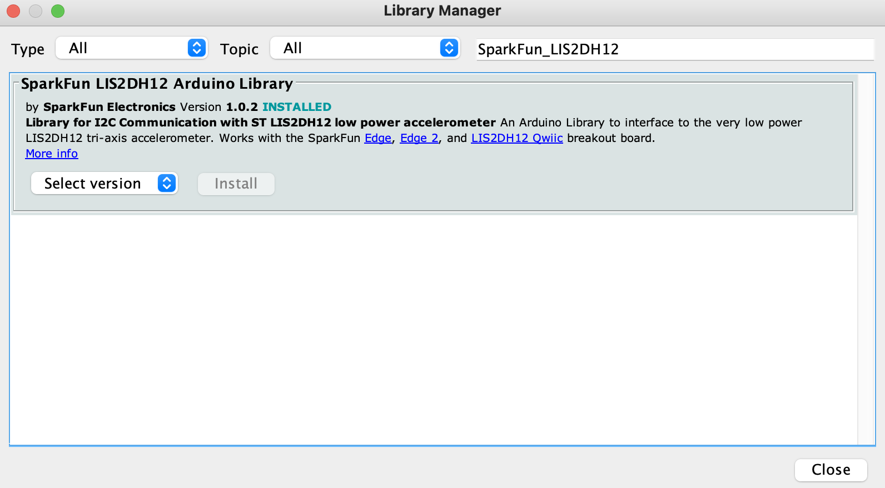

Select the `SparkFun MicroMod nRF52840 Processor Board` under `Tools -> Boards -> Arduino Mbed OS Boards`.

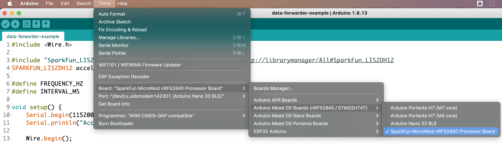

Select the Port (note that it is recognized as the Arduino Nano 33 BLE in my environment):

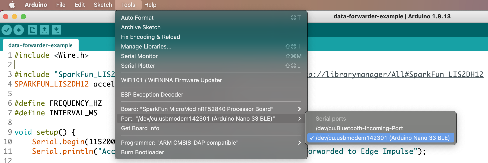

Compile and upload the sketch (using the ➡️ button on the upper left corner). You should get the following results when done:


**Note to Windows users:** *you might see some warnings during the compiliation, this is not an issue, you can keep going and your sketch will run correcty:*

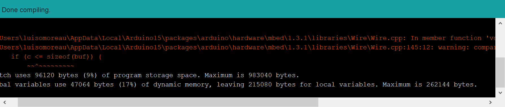

Open the serial monitor and set the baudrate to `115200`. You will see the three axis values displayed as follow:

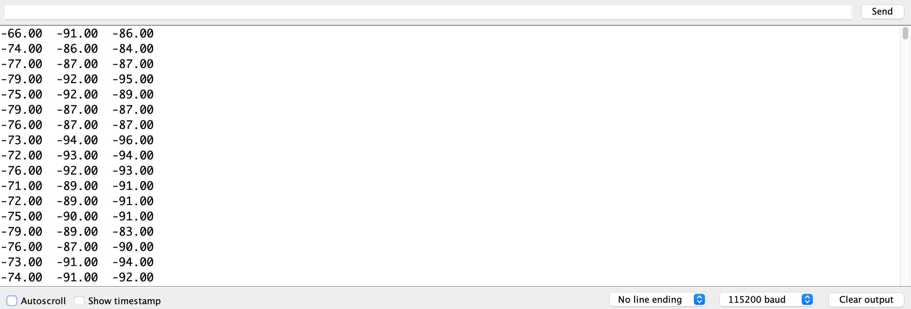

You can now leave your board connected, we will push the some of data to Edge Impulse in the following section.


## Collecting data

If you do not have an Edge Impulse account yet, start by creating an account on [Edge Impulse Studio](https://studio.edgeimpulse.com) and create a project.

You also need to install [Edge Impulse CLI](https://docs.edgeimpulse.com/docs/cli-installation) tools to be able to use the `edge-impulse-data-forwarder`.

### Connect the CLI to your Serial port

Quit the Serial Monitor from your Arduino IDE if still open.

Open a new terminal and run `edge-impulse-data-forwarder --clean`. 

Note that the frequency will be detected automatically but you can overide it by adding the `--frequency 50` flag for example if you have a different value in your arduino sketch.

Follow the prompt and fill the required information:

```
$> edge-impulse-data-forwarder --clean --frequency 50Hz
Edge Impulse data forwarder v1.13.4
? What is your user name or e-mail address (edgeimpulse.com)? louis-demo
? What is your password? [hidden]
Endpoints:
    Websocket: wss://remote-mgmt.edgeimpulse.com
    API:       https://studio.edgeimpulse.com/v1
    Ingestion: https://ingestion.edgeimpulse.com

[SER] Connecting to /dev/tty.usbmodem142301
[SER] Serial is connected (CB:60:AF:81:EA:4A:AA:82)
[WS ] Connecting to wss://remote-mgmt.edgeimpulse.com
[WS ] Connected to wss://remote-mgmt.edgeimpulse.com

? To which project do you want to connect this device? (Use arrow keys)
...
❯ Louis (Demo) / Fitness classifier 
...
[SER] Detecting data frequency...
[SER] Detected data frequency: 51Hz
? 3 sensor axes detected (example values: [-77,-84,-87]). What do you want to call them? Separate the names with ',': accX, accY, accZ
[SER] Overriding frequency to 50Hz (via --frequency)
? What name do you want to give this device? MicroMod nRF52840
[WS ] Device "MicroMod nRF52840" is now connected to project "Fitness classifier"
[WS ] Go to https://studio.edgeimpulse.com/studio/XXXXX/acquisition/training to build your machine learning model!

```

Go back to Edge Impulse Studio and naviagte to the `Devices` view.
Your device is now connected:

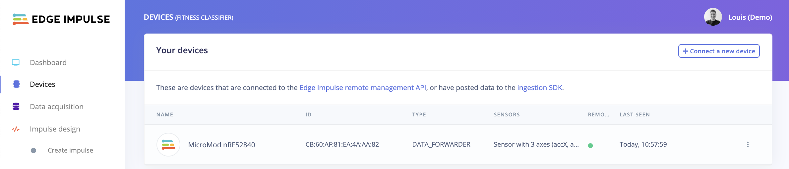

To start collecting some data, go to the `Data acquisition` view, make sure your board is connecting and click on `Start Sampling`:

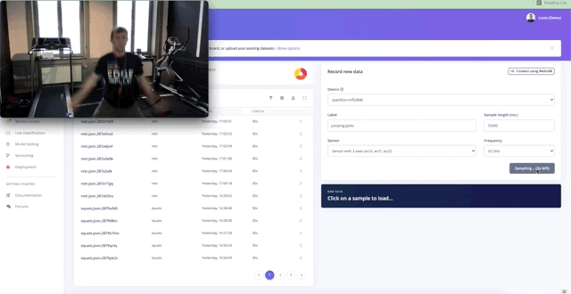

🤫 *Disclamer: Edge Impulse rejects any responsibility for the quality of theses jumping jacks. This scene was not made by professionals, please try to reproduce it better, much better!*

Do this process for each label you want to classify. Do not forget to add some samples in your training set by navigating to the `Test data` on the upper left corner of the `Data acquisition` view.

## Train your Machine Learning Model

Once you have collected enough data, navigate the the `Create Impulse` view:

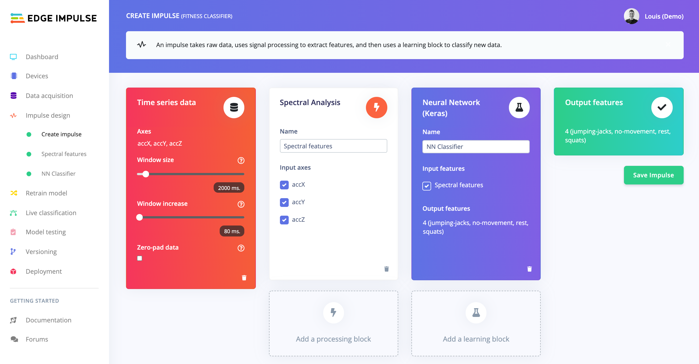

Add a **Spectral Analysis** DSP Block and a **Neural Network** Learning Block.

Click on `Save Impulse` and go to the `Spectral features` view:

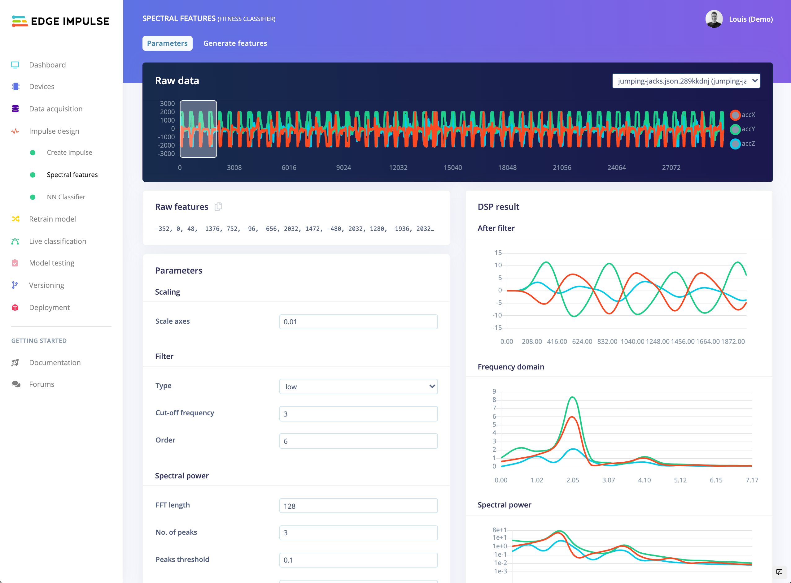

Here, just change the `Scale axis` value to `0.01`, it will help the quantized version of your Neural Network to get a better accuracy.
Click on `Save parameters` at the bottom of this page. 

You should have been redirected to the `Generate feature` tab.

Click on `Generate feature`, wait few seconds and you should see 4 well separated clusters:

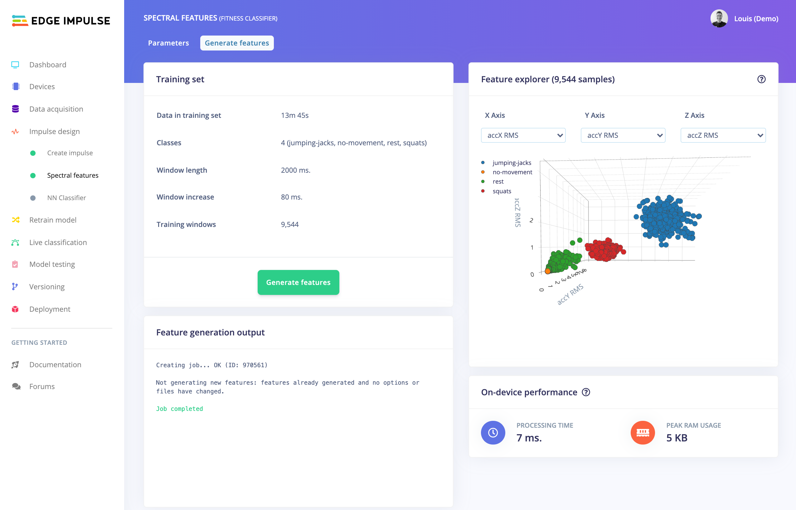

If so, this is good! It means your Neural Network will more likely be able to classify your samples easily.

Now navigate to the `NN Classifier` view and click on `Start Training`. With the default parameters, we obtained a **99.4% accuracy** with a model that can run the inference in 1 ms., using 1.5KB of RAM and 15.5KB of ROM on the nRF52840

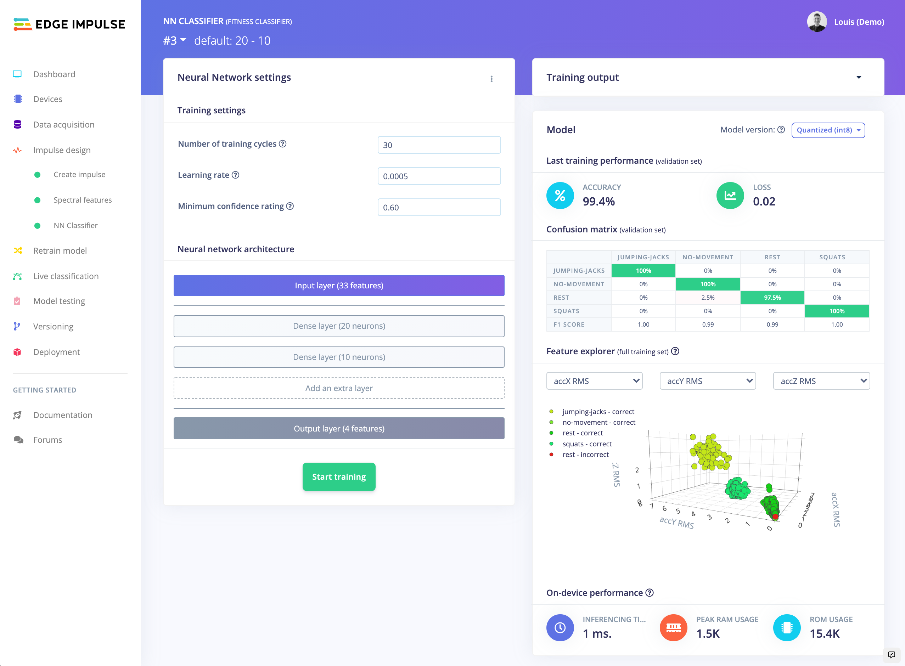

We tried a slightly modified architecture to see if we could achieve some better results:

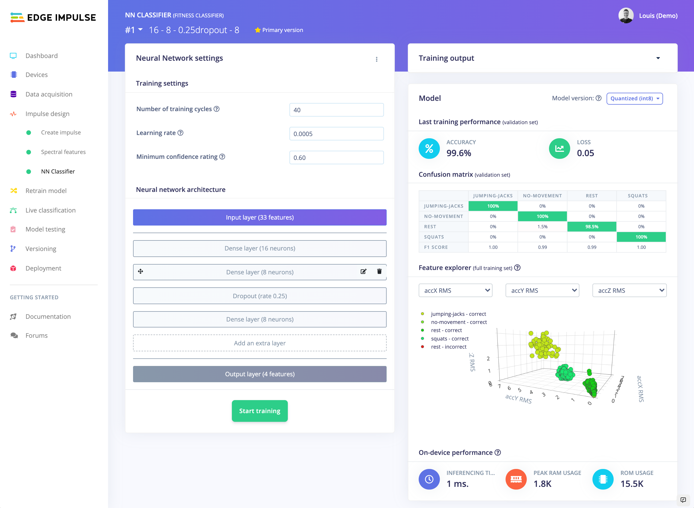

As you can see, we reached a **99.4% accuracy**, however, this model use 1.8KB of RAM. It is completely up to you to choose which model to use, in this case both can easily run on the target.

Now we are satisfied with the Neural Network model, we can test this model on data that have been unknown to the Neural Network. Go to the `Model testing` tab and click on `Classify all`:

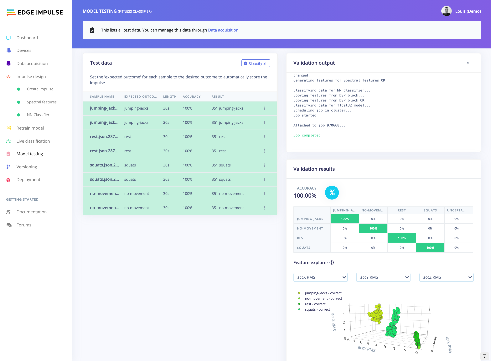

I guess we can validate this model and go to the next step to test it in real conditions!


## Run your inference on the target

### Download the generated Arduino Library

To deploy your model on the Sparkfun / nRF52840 MicroMod board, we will download the **Arduino Library** from the `Deployment` view on Edge Impulse Studio and click on `Build` at the bottom of the page:

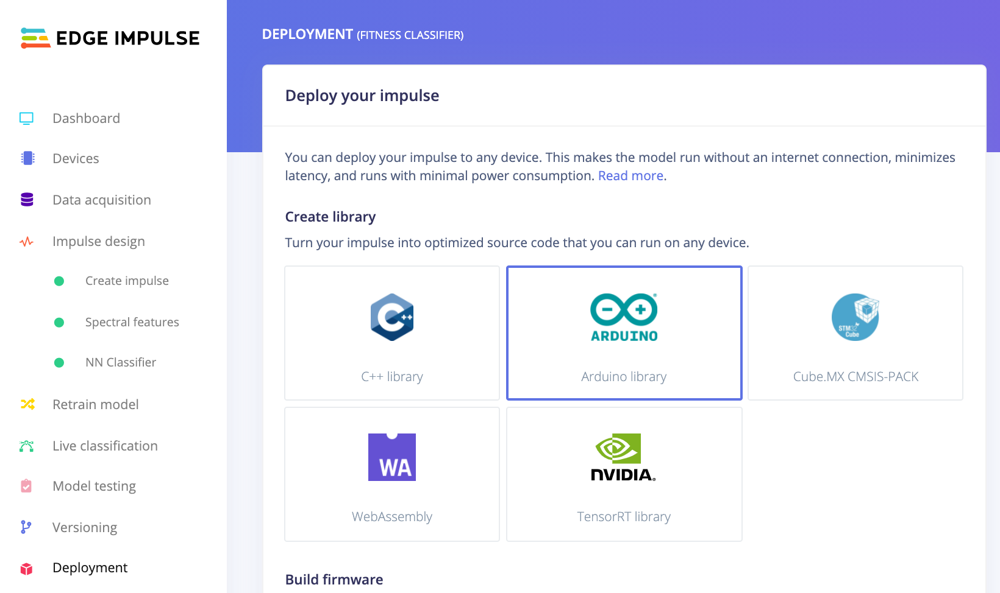

Save the .zip file on your laptop and go back to your arduino IDE.

### Upload the code

Include the generated library in the Arduino IDE and select the .zip file you have just downloaded:

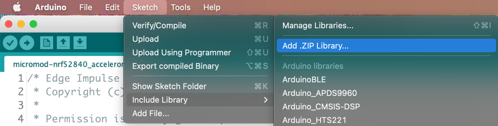

Open the `micromod-nrf52840_accelerometer.ino` sketch from this Github repository or create a new Arduino sketch and copy past the following code:

```
/* Edge Impulse examples
 * Copyright (c) 2021 EdgeImpulse Inc.
 *
 * Permission is hereby granted, free of charge, to any person obtaining a copy
 * of this software and associated documentation files (the "Software"), to deal
 * in the Software without restriction, including without limitation the rights
 * to use, copy, modify, merge, publish, distribute, sublicense, and/or sell
 * copies of the Software, and to permit persons to whom the Software is
 * furnished to do so, subject to the following conditions:
 *
 * The above copyright notice and this permission notice shall be included in
 * all copies or substantial portions of the Software.
 *
 * THE SOFTWARE IS PROVIDED "AS IS", WITHOUT WARRANTY OF ANY KIND, EXPRESS OR
 * IMPLIED, INCLUDING BUT NOT LIMITED TO THE WARRANTIES OF MERCHANTABILITY,
 * FITNESS FOR A PARTICULAR PURPOSE AND NONINFRINGEMENT. IN NO EVENT SHALL THE
 * AUTHORS OR COPYRIGHT HOLDERS BE LIABLE FOR ANY CLAIM, DAMAGES OR OTHER
 * LIABILITY, WHETHER IN AN ACTION OF CONTRACT, TORT OR OTHERWISE, ARISING FROM,
 * OUT OF OR IN CONNECTION WITH THE SOFTWARE OR THE USE OR OTHER DEALINGS IN THE
 * SOFTWARE.
 */

/* Includes ---------------------------------------------------------------- */
#include <Wire.h>
#include "SparkFun_LIS2DH12.h" //Click here to get the library: http://librarymanager/All#SparkFun_LIS2DH12
SPARKFUN_LIS2DH12 accel;       //Create instance

/* Include Edge Impulse Library -------------------------------------------------------- 
 * Modify the following line according to your project name
 * Do not forget to import the library using "Sketch">"Include Library">"Add .ZIP Library..."
 * You can find one library version in this repository under ei-library/ei-fitness-classifier-arduino.zip 
 * that has been generated from this public project https://studio.edgeimpulse.com/public/36037/latest
 */
 #include <Fitness_classifier_inferencing.h>


/* Private variables ------------------------------------------------------- */
static bool debug_nn = false; // Set this to true to see e.g. features generated from the raw signal

/**
* @brief      Arduino setup function
*/
void setup()
{
    // put your setup code here, to run once:
    Serial.begin(115200);
    delay(2000);
    Serial.println("Edge Impulse Inferencing Demo \n using SparkFun MicroMod Machine Learning Carrier Board + nRF52840 Processor Board ");

    Serial.print("EI_CLASSIFIER_DSP_INPUT_FRAME_SIZE: ");
    Serial.println(EI_CLASSIFIER_DSP_INPUT_FRAME_SIZE);

    Serial.print("EI_CLASSIFIER_INTERVAL_MS: ");
    Serial.println(EI_CLASSIFIER_INTERVAL_MS);

    Wire.begin();

    if (accel.begin() == false)
    {
      Serial.println("Accelerometer not detected. Check address jumper and wiring. Freezing...");
      while (1);
    }else{
      accel.setScale(LIS2DH12_2g);
      Serial.print("Accelerometer scale: ");
      Serial.println(accel.getScale());

      accel.setMode(LIS2DH12_LP_8bit);
      Serial.print("Accelerometer mode: ");
      Serial.println(accel.getMode());

      accel.setDataRate(LIS2DH12_ODR_100Hz);
      Serial.print("Accelerometer data rate: ");
      Serial.println(accel.getDataRate());
    }
}

/**
* @brief      Printf function uses vsnprintf and output using Arduino Serial
*
* @param[in]  format     Variable argument list
*/
void ei_printf(const char *format, ...) {
   static char print_buf[1024] = { 0 };

   va_list args;
   va_start(args, format);
   int r = vsnprintf(print_buf, sizeof(print_buf), format, args);
   va_end(args);

   if (r > 0) {
       Serial.write(print_buf);
   }
}

/**
* @brief      Get data and run inferencing
*
* @param[in]  debug  Get debug info if true
*/
void loop()
{
    ei_printf("\n ---------------- \n Starting inferencing...\n");

    //delay(2000);

    ei_printf("Allocating buffer size...");

    // Allocate a buffer here for the values we'll read from the IMU
    float buffer[EI_CLASSIFIER_DSP_INPUT_FRAME_SIZE] = { 0 };

    ei_printf("Done\n");

    ei_printf("Sampling...");

    static unsigned long acquisition_start = millis();
    
    for (size_t ix = 0; ix < EI_CLASSIFIER_DSP_INPUT_FRAME_SIZE; ix += 3) {
        // Determine the next tick (and then sleep later)
        uint64_t next_tick = micros() + (EI_CLASSIFIER_INTERVAL_MS * 1000);

        // read to the end of the buffer
        buffer[ix + 0] = accel.getX();
        buffer[ix + 1] = accel.getY();
        buffer[ix + 2] = accel.getZ();

        delayMicroseconds(next_tick - micros());
    }

    static unsigned long acquisition_end = millis();
    static unsigned long acquisition_time = acquisition_end - acquisition_start;

    ei_printf("Done in %d ms\n", acquisition_time);

    // Turn the raw buffer in a signal which we can the classify
    signal_t signal;
    int err = numpy::signal_from_buffer(buffer, EI_CLASSIFIER_DSP_INPUT_FRAME_SIZE, &signal);
    if (err != 0) {
        ei_printf("Failed to create signal from buffer (%d)\n", err);
        return;
    }
    ei_printf("Done...\n");

    ei_printf("Running the classifier... \n");
    ei_impulse_result_t result = { 0 };

    err = run_classifier(&signal, &result, debug_nn);
    if (err != EI_IMPULSE_OK) {
        ei_printf("ERR: Failed to run classifier (%d)\n", err);
        return;
    }

    // print the predictions
    ei_printf("Predictions ");
    ei_printf("(DSP: %d ms., Classification: %d ms., Anomaly: %d ms.)",
        result.timing.dsp, result.timing.classification, result.timing.anomaly);
    ei_printf(": \n");
    for (size_t ix = 0; ix < EI_CLASSIFIER_LABEL_COUNT; ix++) {
        ei_printf("    %s: %.5f\n", result.classification[ix].label, result.classification[ix].value);
    }
#if EI_CLASSIFIER_HAS_ANOMALY == 1
    ei_printf("    anomaly score: %.3f\n", result.anomaly);
#endif
}
```

The name of the library may differ from the provided example, just delete this line: `#include <Fitness_classifier_inferencing.h>` and add your own:

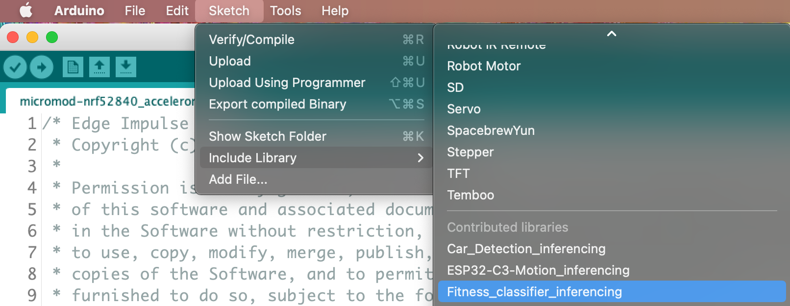

You can now compile and upload the sketch on the target (using the ➡️ button on the upper left corner):


## Going further: Send your inference over Bluetooth

If you want to go further and send your inference results over Bluetooth Low Energy, open the `inference-over-bluetooth.ino` arduino sketch under `arduino-examples/inference-over-bluetooth` folder.

Compile the sketch and deploy it on your MicroMod processor. On the serial monitor, you will see something similar to this:

```
Edge Impulse Inferencing Demo 
using SparkFun MicroMod Machine Learning Carrier Board + nRF52840 Processor Board 
EI_CLASSIFIER_DSP_INPUT_FRAME_SIZE: 375
EI_CLASSIFIER_INTERVAL_MS: 16
Peripheral device MAC: af:81:ea:4a:aa:28
Waiting for connections...

```

To connect to your board, you will need to install the `Nordic Semiconductors nRF Connect App`. Both Android and IOS versions exists:


- [Google Play](https://play.google.com/store/apps/details?id=no.nordicsemi.android.mcp)
- [App Store](https://itunes.apple.com/us/app/nrf-connect/id1054362403?ls=1&mt=8)

Open the app and click on the scanner tab:

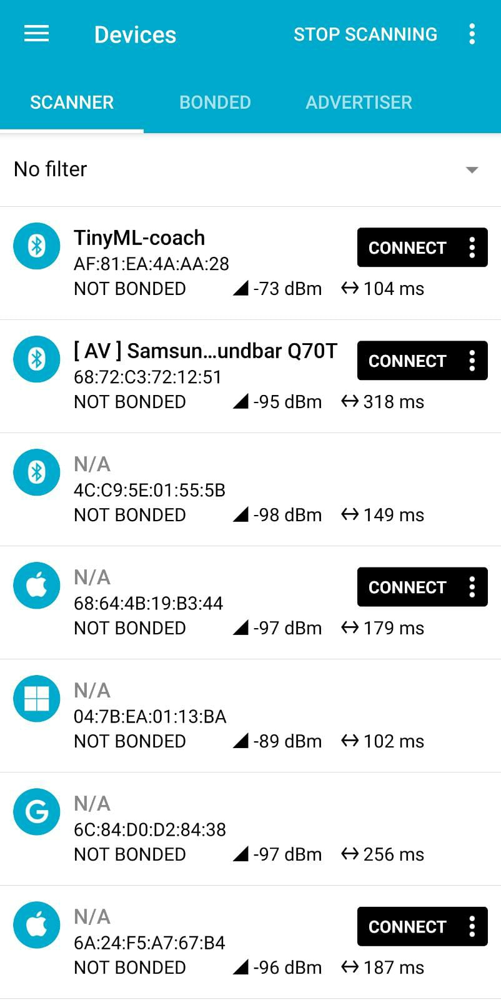

Click on `Connect` on the TinyML-coach device.

Wait few seconds, you should see the following view:

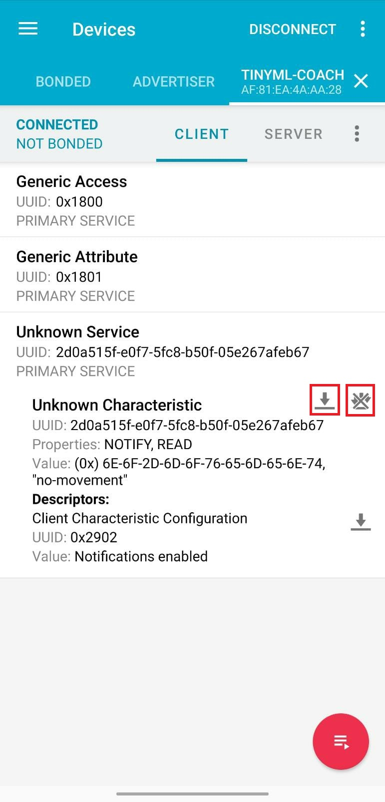

Click on the two button where you see the red boxes on the upper picture to receive updates as the inference results changes and to decode the payload.

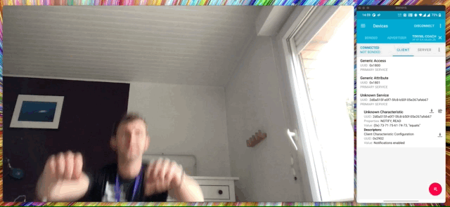

Et voilà, you have reached the end of this tutorial 👏

Thank you for having followed this tutorial. If you have any further questions, please ask them on Edge Impulse Forum: [https://forum.edgeimpulse.com](https://forum.edgeimpulse.com/). We will be happy to help you.


## Resources

You can reproduce this project using:

- The public project on Edge Impulse Studio: [https://studio.edgeimpulse.com/public/36037/latest](https://studio.edgeimpulse.com/public/36037/latest)

- The code and the tutorial on Github: [https://github.com/edgeimpulse/example-SparkFun-MicroMod-nRF52840](https://github.com/edgeimpulse/example-SparkFun-MicroMod-nRF52840)