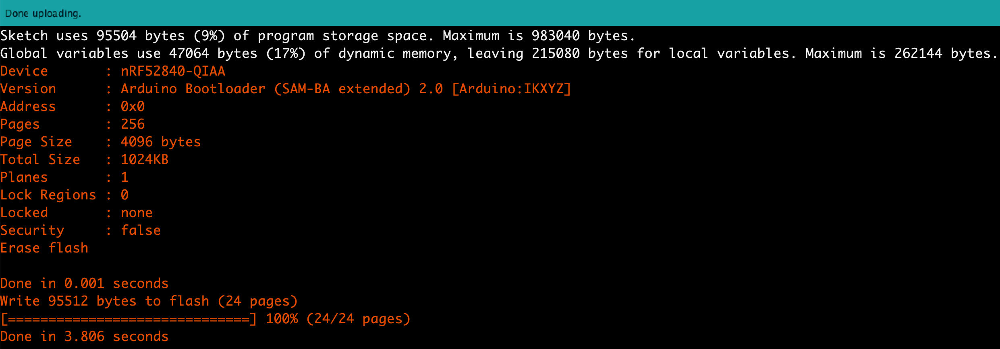
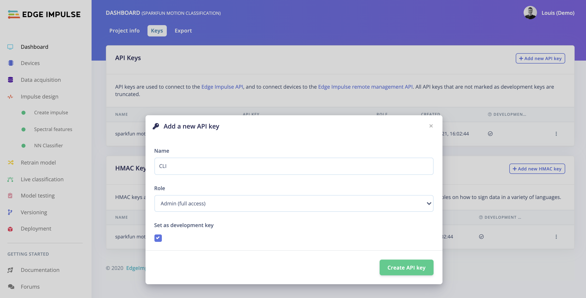
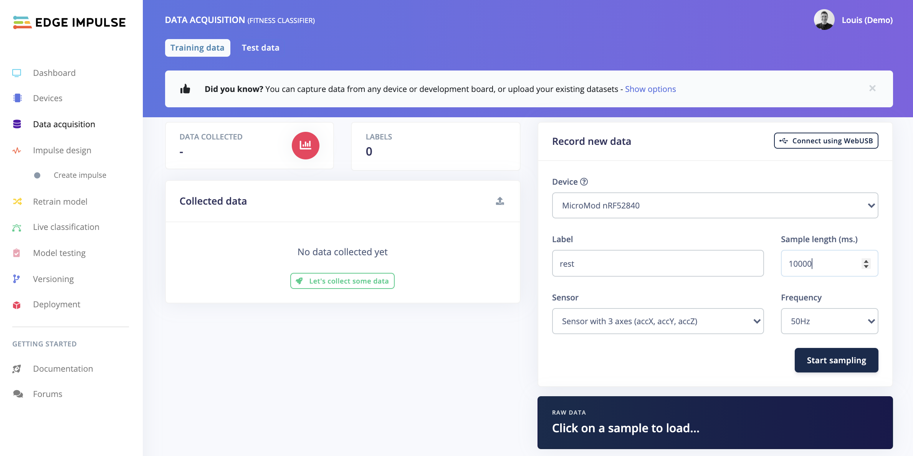

# example-SparkFun-MicroMod-nRF52840

This example has been designed for this workshop hosted by SparkFun: [AI Workshop: Meet Your New Fitness Trainer](https://learn.sparkfun.com/events/204_).

This tutorial is using:

**Hardware:**

- [SparkFun MicroMod Machine Learning Carrier Board](https://www.sparkfun.com/products/16400)

- [Nordic NRF52840 MicroMod Processor Board](https://www.sparkfun.com/products/16984)


**Tools and Softwares:**

- [Edge Impulse Studio](https://studio.edgeimpulse.com) and [Edge Impulse CLI](https://docs.edgeimpulse.com/docs/cli-installation)
- [Arduino IDE](https://www.arduino.cc/en/software)

## Installing the dependencies

### Install Arduino IDE

Download the lastest Arduino version: [https://www.arduino.cc/en/main/software](https://www.arduino.cc/en/main/software)


We have been testing with Arduino 1.8.13. It should work also with the current latest Arduino IDE version (1.8.15). However, we do not recommend to use the Arduino IDE 2.0 beta at the moment as it has some breaking changes.

### Adding the MicroMod nRF52840 Board to Arduino IDE

A complete and official guide is provided in the following link to setup Arduino IDE to run with the nRF52840 Processor board: [https://learn.sparkfun.com/tutorials/micromod-nrf52840-processor-hookup-guide/arduino-software-setup](https://learn.sparkfun.com/tutorials/micromod-nrf52840-processor-hookup-guide/arduino-software-setup).

*Note that recently, Arduino has deprecated the Arduino Mbed OS Boards to provided standalone package for each boards:*


In order to be able to compile and run this project on the MicroMod nRF52840 Processor, you will need to install the version `1.3.1` of this deprecated package. Sparkfun is working on a fix, the official guide should be update once done.

Do not forget to restard your Arduino IDE after having added the board in the application folder.

### Run the data-forwarder-example sketch

To make sure the board works, test the `data-forwarder-example` sketch present in this repository. Just open the `.ino` file or copy past the following code in a new sketch:

```
#include <Wire.h>

#include "SparkFun_LIS2DH12.h" //Click here to get the library: http://librarymanager/All#SparkFun_LIS2DH12
SPARKFUN_LIS2DH12 accel;       //Create instance

#define FREQUENCY_HZ        50
#define INTERVAL_MS         (1000 / (FREQUENCY_HZ + 1))

void setup() {
    Serial.begin(115200);
    Serial.println("Accelerometer reading in Serial Console to be forwarded to Edge Impulse");

    Wire.begin();

    if (accel.begin() == false)
    {
      Serial.println("Accelerometer not detected. Check address jumper and wiring. Freezing...");
      while (1);
    }
    accel.setDataRate(LIS2DH12_ODR_100Hz);
}

void loop() {
    static unsigned long last_interval_ms = 0;
    
    if (accel.available() && millis() > last_interval_ms + INTERVAL_MS) {
        last_interval_ms = millis();
  
        Serial.print(accel.getX());
        Serial.print('\t');
        Serial.print(accel.getY());
        Serial.print('\t');
        Serial.println(accel.getY());   
    }
}
```

You will need to install the accelerometer library, simply click on the link `http://librarymanager/All#SparkFun_LIS2DH12` in the Arduino IDE, it will open the following window:


Select the `SparkFun MicroMod nRF52840 Processor Board` under `Tools -> Boards -> Arduino Mbed OS Boards`.


Select the Port (note that it is recognized as the Arduino Nano 33 BLE in my environment):


Compile and upload the sketch (using the ➡️ button on the upper left corner). You should get the following results when done:



On the serial monitor and set the baudrate to `115200`. You will see the three axis values displayed as follow:


You can now leave your board connected, we will push the some of data to Edge Impulse in the following section.


## Collecting data

If you do not have an Edge Impulse account yet, start by creating an account on [Edge Impulse Studio](https://studio.edgeimpulse.com) and create a project.

You also need to install [Edge Impulse CLI](https://docs.edgeimpulse.com/docs/cli-installation) tools to be able to use the `edge-impulse-data-forwarder`.

### API Keys

On your `Dashboard` view of your Edge Impulse project, navgate to the `Keys` tab and create a new API Key for your CLI:



Copy your new API key, it looks like something similar to `ei_...`.

### Connect the CLI to your Serial port

Quit the Serial Monitor from your Arduino IDE if still open.

Open a new terminal and run `edge-impulse-data-forwarder --clean --frequency 50Hz`. Follow the prompt to fill the required information:

```
$> edge-impulse-data-forwarder --clean --frequency 50Hz
Edge Impulse data forwarder v1.13.4
? What is your user name or e-mail address (edgeimpulse.com)? louis-demo
? What is your password? [hidden]
Endpoints:
    Websocket: wss://remote-mgmt.edgeimpulse.com
    API:       https://studio.edgeimpulse.com/v1
    Ingestion: https://ingestion.edgeimpulse.com

[SER] Connecting to /dev/tty.usbmodem142301
[SER] Serial is connected (CB:60:AF:81:EA:4A:AA:82)
[WS ] Connecting to wss://remote-mgmt.edgeimpulse.com
[WS ] Connected to wss://remote-mgmt.edgeimpulse.com

? To which project do you want to connect this device? (Use arrow keys)
...
❯ Louis (Demo) / Fitness classifier 
...
[SER] Detecting data frequency...
[SER] Detected data frequency: 51Hz
? 3 sensor axes detected (example values: [-77,-84,-87]). What do you want to call them? Separate the names with ',': accX, accY, accZ
[SER] Overriding frequency to 50Hz (via --frequency)
? What name do you want to give this device? MicroMod nRF52840
[WS ] Device "MicroMod nRF52840" is now connected to project "Fitness classifier"
[WS ] Go to https://studio.edgeimpulse.com/studio/XXXXX/acquisition/training to build your machine learning model!

```

Go back to Edge Impulse Studio and naviagte to the `Devices` view.
Your device is now connected:


To start collecting some data, go to the `Data acquisition` view:




## Train your Machine Learning Model


## Run your inference on the target


